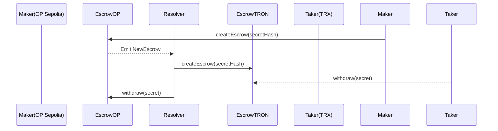

# 1inch Fusion+ Cross‑Chain Swap (OP Sepolia ↔ Tron)
**Product Requirements Document – README.md**

---

## 1. Purpose

Enable **permission‑less, bidirectional token swaps between Optimism Sepolia and Tron** inside the 1inch Fusion+ flow.  
The feature must preserve **hash‑lock + time‑lock** guarantees and demonstrate on‑chain execution on public *test‑nets* (**OP Sepolia** ⇄ **Nile**).

---

## 2. Scope

|                | **In‑scope (qualification)**                               | **Out‑of‑scope / Stretch** |
| -------------- | ----------------------------------------------------------- | --------------------------- |
| Core HTLC escrow contracts on both chains | ✅ | ❌ |
| Resolver bot that funds & releases escrows | ✅ | ❌ |
| Open‑source repo with tests & demo scripts | ✅ | ❌ |
| UI, partial fills, relayer marketplace     | ❌ (nice‑to‑have) | ✅ later |

---

## 3. Problem Statement

1inch Fusion+ currently supports EVM ↔ EVM swaps but not EVM L2 ↔ non‑EVM networks.  
Optimism (OP Stack) differs from L1 Ethereum in **fee market, block production, and finality windows**.  
Users therefore cannot:

* Swap **OP Sepolia ETH / tokens** to **TRC‑20** without using a custodial bridge.
* Enjoy MEV‑safe Dutch‑auction pricing and gas‑less UX provided by Fusion+.

---

## 4. Goals & Non‑Goals

* **Goals**
  1. Deploy audited HTLC escrow contracts on **OP Sepolia** and **Nile**.
  2. Prove live OP‑ETH → TRX and TRX → OP‑ETH swaps of test‑USDT during demo.
  3. Document a reproducible dev‑stack (Hardhat + TronBox / Hardhat‑Tron plugin).

* **Non‑Goals**
  * Mobile UI, main‑net launch, fee optimisation.

---

## 5. User Stories

| ID | As a … | I want to … | So that … |
|----|--------|-------------|-----------|
| U1 | 1inch trader | swap USDT on OP Sepolia for USDT on Tron in one click | I avoid wrap/unwrap bridges |
| U2 | Resolver | earn safety‑deposit fees | I’m incentivised to fill orders |
| U3 | DevRel judge | replay the demo from README | I can verify qualification |

---

## 6. Architecture Overview



* **HashLock**: `secretHash = keccak256(secret)`.  
* **TimeLock**: `cancelLock` > `finalityLock`; both values chain‑specific.  
* **Safety deposit**: covers L2 Gas / Tron Energy on each chain, reclaimed on success.

---

## 7. Functional Requirements

| # | Requirement |
|---|-------------|
| F‑1 | `createEscrow`, `withdraw`, `cancel` exposed on both chains |
| F‑2 | `withdraw` validates `secretHash` **and** `block.number ≥ finalityLock` |
| F‑3 | Escrow emits `NewEscrow`, `Withdrawn`, `Cancelled` events |
| F‑4 | Resolver bot listens to events and orchestrates swap |
| F‑5 | Repo contains Hardhat tasks: `deploy`, `swap:op2tron`, `swap:tron2op` |

---

## 8. Non‑Functional Requirements

* **Security**: Re‑entrancy guards; secret reuse prevention.
* **Gas / Energy budget**: Each escrow ≤ 150 k gas (OP) and ≤ 140 k Energy (Tron).
* **Reliability**: Resolver retries every 3 s, aborts after `cancelLock`.
* **Developer‑UX**: One‑command local test (`npm run test:integration`).

---

## 9. Technical Design

### 9.1 Contract Interface (Solidity 0.8.24)

```solidity
struct Escrow {
    address  initiator;
    address  target;
    address  token;
    uint256  amount;
    uint256  safetyDeposit;
    bytes32  secretHash;
    uint64   finalityLock;
    uint64   cancelLock;
    bool     withdrawn;
}

function createEscrow(Escrow calldata e) external payable;
function withdraw(bytes32 secret, bytes32 id) external;
function cancel(bytes32 id) external;
```

* **OP Sepolia**: ERC‑20 via OpenZeppelin.  
* **Tron**: same ABI; TVM treats TRC‑20 like ERC‑20.

### 9.2 Tool‑chain

| Chain | Compiler & Toolkit |
|-------|--------------------|
| OP Sepolia | Hardhat / Foundry |
| Tron | TronBox *or* Hardhat‑Tron plugin (`@layerzerolabs/hardhat-tron`) |

### 9.3 Resolver Bot

* **Stack**: Node 18, `ethers.js` (OP provider), `tronweb`, `@1inch/fusion-sdk`.  
* **Logic**:  
  1. Listen for Fusion+ RFQ with `dstChainId == TRON`.  
  2. Fund source escrow (`createEscrow`) on OP Sepolia.  
  3. Wait `finalityLock`.  
  4. Mirror escrow on Nile.  
  5. Publish `secret`; call `withdraw` both sides.  
  6. On timeout ⇒ `cancel`.

---

## 10. Step‑by‑Step Implementation Guide

1. **Fork repo skeleton**  
   ```bash
   npx degit your-org/fusion-tron-template fusion-tron
   ```

2. **Install deps**  
   ```bash
   cd fusion-tron
   pnpm i                      # or npm/yarn
   ```

3. **Configure networks** (`hardhat.config.ts`)  
   ```ts
   networks: {
     opSepolia: { 
       url: "https://sepolia.optimism.io", 
       chainId: 11155420,
       accounts: [PK] 
     },
     tronNile: { 
       url: "https://api.nileex.io/jsonrpc", 
       chainId: 3448148188,
       accounts: [PK] 
     }
   }
   ```

4. **Write Escrow.sol** → `contracts/Escrow.sol`.

5. **Deploy**  
   ```bash
   npx hardhat deploy --network opSepolia
   npx hardhat deploy --network tronNile
   ```

6. **Fund test wallets**  
   * OP Sepolia faucet (optimismfaucet.com).  
   * Nile faucet.

7. **Run resolver bot (local)**  
   ```bash
   pnpm start:resolver
   ```

8. **Execute demo swap**  
   ```bash
   npx hardhat swap:op2tron --amount 1000000 --token 0x...USDT
   ```

9. **Verify** on Optimistic Etherscan + Tronscan.

---

## 11. Parameter Tuning

| Parameter | Suggested value (OP) | Suggested value (Tron) | Rationale |
|-----------|----------------------|------------------------|-----------|
| `finalityLock` | 20 blocks ≈ 40 s | 12 blocks ≈ 36 s | Cover rollup proposer delays |
| `cancelLock`   | 30 min           | 45 min                | Give resolver shorter reclaim window |
| `safetyDeposit`| 2 × max expected gas | 2 × max Energy | Protect against fee spikes |

---

## 12. Milestones & Timeline (≈ 1 week)

| Day | Deliverable |
|-----|-------------|
| 0.5 | Architecture doc & repo skeleton |
| 1.5 | Escrow contracts + unit tests |
| 3   | Resolver bot MVP |
| 4   | Integration tests (OP Sepolia ⇄ Nile) |
| 5   | Demo scripts & README polish |
| 6   | Buffer / bug‑fix |
| 7   | Final recording |

---

## 13. Acceptance Criteria

* ✅ Contract addresses & tx hashes in demo.  
* ✅ Two successful swaps (OP→TRX, TRX→OP).  
* ✅ README reproduces environment from scratch.  
* ✅ Tests pass (`pnpm test`) on CI.

---

## 14. Risks & Mitigations

| Risk | Impact | Mitigation |
|------|--------|-----------|
| OP sequencer downtime | ⏳ swap delay | Monitor status.optimism.io; allow extra `cancelLock` |
| Nile downtime | ⏳ swap stuck | Support Shasta as fallback |
| Secret leakage | ☠️ fund loss | Bot encrypts secret until reveal |
| Fee spikes | 🛑 resolver loss | Safety deposit = 2 × avg gas/energy |

---

## 15. References

* Optimism OP Sepolia docs – community.optimism.io  
* Hardhat‑Tron plugin – npmjs.com/package/@layerzerolabs/hardhat-tron  
* Tron Nile faucet – Nile test‑net docs  

---

*Happy building!*
---

## 16. Extending to Additional EVM Chains (e.g., Base Sepolia)

Once the HTLC escrow contracts and resolver bot are live on **OP Sepolia ↔ Tron**, you can **reuse the exact same codebase** to support *any* EVM‑compatible network such as **Base Sepolia**, Linea, zkSync Era, etc.  
All differences are handled by configuration, *not* by rewriting Solidity.

### 16.1 What Stays the Same

| Layer | Why it “just works” |
|-------|---------------------|
| Escrow contract byte‑code | Pure Solidity 0.8.24, no chain‑specific opcodes. |
| Hash‑/time‑lock logic | Relies only on `block.number` and `keccak256`. |
| Front‑end & Fusion SDK usage | Accepts `(chainId, contractAddress)` parameters. |
| Resolver bot core | Uses `ethers.js` providers; swap in a new RPC URL. |

### 16.2 Chain‑Specific Parameters to Adjust

| Item | Base Sepolia example | Notes |
|------|----------------------|-------|
| `chainId` | `84532` | Update Hardhat & resolver config. |
| RPC / Explorer URLs | `https://sepolia.base.org` • `https://sepolia.basescan.org` | Provider + verification links. |
| Gas token & faucet | Sepolia ETH on Base | Ensure `safetyDeposit` covers L2 gas costs. |
| `finalityLock` | ≈ 12 blocks (≈ 24 s) | Tune per block time. |
| `cancelLock` | 20–30 min | Allow buffer for cross‑chain latency. |
| Token addresses | Test USDC on Base, TRC‑20 on Tron | Update `Escrow.token`. |
| Resolver chain map | `{ "84532": "Base Sepolia" }` | Used by bot to pick RPC + contract. |

### 16.3 Porting Checklist (OP Sepolia → Base Sepolia)

```bash
# 1. Deploy escrow to Base Sepolia
npx hardhat deploy --network baseSepolia

# 2. Add network to hardhat.config.ts
#    chainId: 84532, url: "https://sepolia.base.org"

# 3. Update resolver config (.env / json)
#    "84532": { "escrow": "BASE_ESCROW_ADDR", ... }

# 4. Tune constants
#    finalityLock, cancelLock, safetyDeposit

# 5. Fund wallet via Base faucet

# 6. Run swap script
npx hardhat swap:base2tron --amount 1000000 --token 0x...USDC
```

> **Note 🛈**  
> 1inch Fusion’s relayer network already supports major EVM chains (including Base main‑net).  
> On test‑nets that are not yet whitelisted, you can operate with your **private resolver** and bypass the public RFQ layer—the escrow contracts still guarantee atomicity with Tron.

Adding a new EVM chain is therefore a **deploy + config** exercise, not a redevelopment effort.
