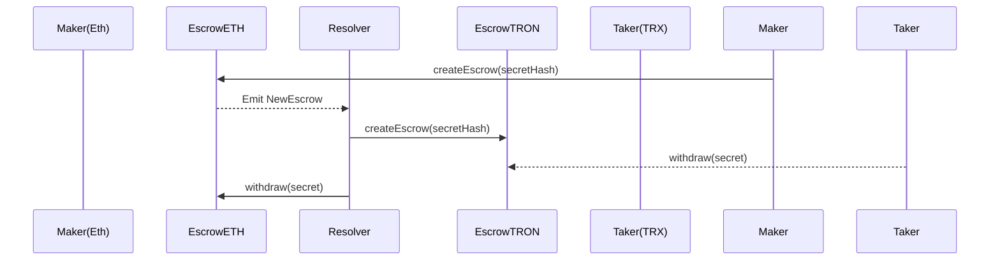

# 1inch Fusion+ Cross‑Chain Swap (Ethereum ↔ Tron)
**Product Requirements Document – README.md**

---

## 1. Purpose

Enable **permissionless, bidirectional token swaps between Ethereum and Tron** inside the 1inch Fusion+ flow.  
The feature must preserve **hash‑lock + time‑lock** guarantees and demonstrate on‑chain execution on public *test‑nets* (Sepolia ⇄ Nile).

---

## 2. Scope

|                | **In‑scope (qualification)**                               | **Out‑of‑scope / Stretch** |
| -------------- | ----------------------------------------------------------- | --------------------------- |
| Core HTLC escrow contracts on both chains | ✅ | ❌ |
| Resolver bot that funds & releases escrows | ✅ | ❌ |
| Open‑source repo with tests & demo scripts | ✅ | ❌ |
| UI, partial fills, relayer marketplace     | ❌ (nice‑to‑have) | ✅ later |

---

## 3. Problem Statement

1inch Fusion+ currently supports only EVM ↔ EVM hops. Tron, although Solidity‑compatible, uses TVM and a *different* fee model (Bandwidth / Energy). Users therefore cannot:

* Swap TRC‑20 ⇄ ERC‑20 without using a custodial bridge.
* Enjoy MEV‑safe Dutch‑auction pricing and gasless UX provided by Fusion+.

---

## 4. Goals & Non‑Goals

* **Goals**
  1. Deploy audited HTLC escrow contracts on **Sepolia** and **Nile**.
  2. Prove live ETH→TRX and TRX→ETH swaps of test‑USDT during demo.
  3. Document a reproducible dev‑stack (Hardhat + TronBox / Hardhat‑Tron plugin).

* **Non‑Goals**
  * Mobile UI, main‑net launch, fee optimization.

---

## 5. User Stories

| ID | As a … | I want to … | So that … |
|----|--------|-------------|-----------|
| U1 | 1inch trader | swap USDT on Ethereum for USDT on Tron in one click | I avoid wrap/unwrap bridges |
| U2 | Resolver | earn safety‑deposit fees | I’m incentivised to fill orders |
| U3 | DevRel judge | replay the demo from README | I can verify qualification |

---

## 6. Architecture Overview



* **HashLock**: `secretHash = keccak256(secret)`.  
* **TimeLock**: `cancelLock` > `finalityLock`; both values chain‑specific.  
* **Safety deposit**: covers Energy/Gas on each chain, reclaimed on success.

---

## 7. Functional Requirements

| # | Requirement |
|---|-------------|
| F‑1 | `createEscrow`, `withdraw`, `cancel` exposed on both chains |
| F‑2 | `withdraw` validates `secretHash` **and** `block.number ≥ finalityLock` |
| F‑3 | Escrow emits `NewEscrow`, `Withdrawn`, `Cancelled` events |
| F‑4 | Resolver bot listens to events and orchestrates swap |
| F‑5 | Repo contains Hardhat tasks: `deploy`, `swap:eth2tron`, `swap:tron2eth` |

---

## 8. Non‑Functional Requirements

* **Security**: Re‑entrancy guards; secret reuse prevention.
* **Gas/Energy budget**: Each escrow ≤ 150 k gas (ETH) and ≤ 140 k Energy (Tron).
* **Reliability**: Resolver retries every 3 s, aborts after `cancelLock`.
* **Developer‑UX**: One‑command local test (`npm run test:integration`).

---

## 9. Technical Design

### 9.1 Contract Interface (Solidity 0.8.24)

```solidity
struct Escrow {
    address  initiator;
    address  target;
    address  token;
    uint256  amount;
    uint256  safetyDeposit;
    bytes32  secretHash;
    uint64   finalityLock;
    uint64   cancelLock;
    bool     withdrawn;
}

function createEscrow(Escrow calldata e) external payable;
function withdraw(bytes32 secret, bytes32 id) external;
function cancel(bytes32 id) external;
```

* **Ethereum**: ERC‑20 via OpenZeppelin.  
* **Tron**: same ABI; TVM treats TRC‑20 like ERC‑20.

### 9.2 Tool‑chain

| Chain | Compiler & Toolkit |
|-------|--------------------|
| Ethereum | Hardhat / Foundry |
| Tron | TronBox *or* Hardhat‑Tron plugin (`@layerzerolabs/hardhat-tron`) |

### 9.3 Resolver Bot

* **Stack**: Node 18, `ethers.js`, `tronweb`, `@1inch/fusion-sdk`.  
* **Logic**:  
  1. Listen for Fusion+ RFQ with `dstChainId == TRON`.  
  2. Fund source escrow (`createEscrow`).  
  3. Wait `finalityLock`.  
  4. Mirror escrow on destination chain.  
  5. Publish `secret` to relayer; call `withdraw` both sides.  
  6. On timeout ⇒ `cancel`.

---

## 10. Step‑by‑Step Implementation Guide

1. **Fork repo skeleton**  
   ```bash
   npx degit your-org/fusion-tron-template fusion-tron
   ```

2. **Install deps**  
   ```bash
   cd fusion-tron
   pnpm i                      # or npm/yarn
   ```

3. **Configure networks** (`hardhat.config.ts`)  
   ```ts
   networks: {
     sepolia: { url: "...", accounts: [PK] },
     tronNile: { url: "https://api.nileex.io/jsonrpc", 
                 accounts: [PK], 
                 chainId: 3448148188 } // Nile
   }
   ```

4. **Write Escrow.sol** → `contracts/Escrow.sol`.

5. **Deploy**  
   ```bash
   npx hardhat deploy --network sepolia
   npx hardhat deploy --network tronNile
   ```

6. **Fund test wallets**  
   * Sepolia faucet (Alchemy).  
   * Nile faucet.

7. **Run resolver bot (local)**  
   ```bash
   pnpm start:resolver
   ```

8. **Execute demo swap**  
   ```bash
   npx hardhat swap:eth2tron --amount 1000000 --token 0x...USDT
   ```

9. **Verify** on Etherscan + Tronscan.

---

## 11. Milestones & Timeline (≈ 1 week)

| Day | Deliverable |
|-----|-------------|
| 0.5 | Architecture doc & repo skeleton |
| 1.5 | Escrow contracts + unit tests |
| 3   | Resolver bot MVP |
| 4   | Integration tests (Sepolia ⇄ Nile) |
| 5   | Demo scripts & README polish |
| 6   | Buffer / bug‑fix |
| 7   | Final recording |

---

## 12. Acceptance Criteria

* ✅ Contract addresses & tx hashes in demo.  
* ✅ Two successful swaps (ETH→TRX, TRX→ETH).  
* ✅ README reproduces environment from scratch.  
* ✅ Tests pass (`pnpm test`) on CI.

---

## 13. Risks & Mitigations

| Risk | Impact | Mitigation |
|------|--------|-----------|
| Nile downtime | ⏳ swap stuck | Support Shasta as fallback |
| Secret leakage | ☠️ fund loss | Bot encrypts secret until reveal |
| Fee spikes | 🛑 resolver loss | Safety deposit = 2× avg gas/energy |

---

## 14. References

* Hardhat‑Tron plugin – npmjs.com/package/@layerzerolabs/hardhat-tron  
* Tron Nile faucet – Nile test‑net docs  
* Tron Nile test‑net documentation – docs.tron.network

---

*Happy building!*
