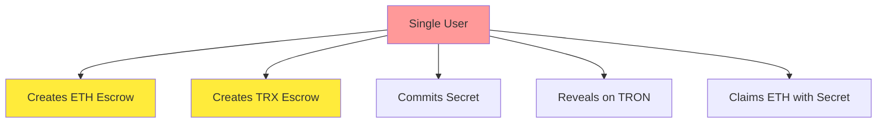
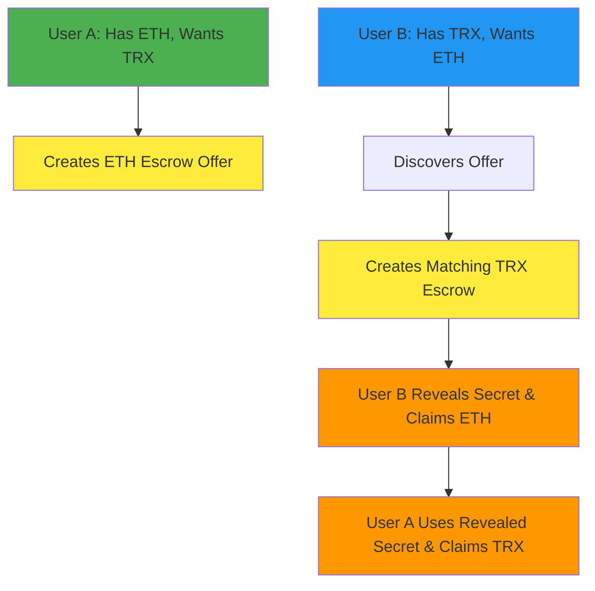

# Proper Cross-Chain Swap Implementation Guide

## Executive Summary

The current `atomic-swap.js` implementation successfully demonstrates the **technical feasibility** of cross-chain atomic swaps between Ethereum and TRON networks. However, it represents a **single-user proof-of-concept** rather than a true peer-to-peer cross-chain trading system. This document outlines the current state and the path to achieving a proper two-user cross-chain swap implementation.

## Current Implementation Analysis

### What We Have (Single-User Demo)

```javascript
// Current: One entity controls both wallets
const ethWallet = new ethers.Wallet(
  process.env.RESOLVER_PRIVATE_KEY,
  ethProvider
);
const tronWeb = new TronWeb({ privateKey: process.env.TRON_PRIVATE_KEY });
```

**Achieved Technical Milestones:**

- ✅ Cross-chain escrow creation on both Ethereum Sepolia and TRON Nile
- ✅ Atomic secret reveal mechanism with proper finality waiting
- ✅ MEV protection through commit-reveal scheme
- ✅ Address format conversion between TRON and Ethereum standards
- ✅ Real escrow ID extraction from blockchain events
- ✅ Comprehensive error handling and transaction verification

**Transaction Evidence:**

- TRON Reveal: `94cdeb75847c87e1d33377584739500df3f0f05daec7724ad802c8c1fb097359`
- ETH Reveal: `0x1fc4730972a3d2c2f0f4759f642372403155b32e6d05566633361f511ad51ee9`

### Current Flow (Self-Swap)



**Result:** User moves their own funds from their ETH wallet to their TRX wallet through atomic swap contracts.

## What's Missing: True Cross-Chain Trading

### Required: Two-User Architecture

```javascript
// Required: Separate users with different wallets
const userA = {
  ethWallet: new ethers.Wallet(process.env.USER_A_ETH_PRIVATE_KEY),
  tronReceiveAddress: process.env.USER_A_TRX_RECEIVE_ADDRESS,
};

const userB = {
  tronWeb: new TronWeb({ privateKey: process.env.USER_B_TRX_PRIVATE_KEY }),
  ethReceiveAddress: process.env.USER_B_ETH_RECEIVE_ADDRESS,
};
```

### Proper Cross-Chain Swap Flow



## Implementation Requirements

### 1. Order Discovery & Matching System

**Current State:** No order book or matching mechanism

**Required Infrastructure:**

```javascript
// Order book API for discovering swap opportunities
class OrderBook {
  async postSwapOffer(offer) {
    // Post User A's ETH→TRX offer
  }

  async findMatchingOffers(criteria) {
    // User B discovers User A's offer
  }

  async acceptOffer(offerId, counterOffer) {
    // User B creates matching TRX escrow
  }
}
```

**Implementation Options:**

- Centralized order book service
- Decentralized order book (using IPFS + blockchain events)
- Peer-to-peer discovery (DHT-based)
- Integration with existing DEX aggregators

### 2. Multi-User Wallet Management

**Current:** Single resolver controls both chains

```javascript
// Current single-user approach
this.ethWallet = new ethers.Wallet(process.env.RESOLVER_PRIVATE_KEY);
this.tronWeb = new TronWeb({ privateKey: process.env.TRON_PRIVATE_KEY });
```

**Required:** Separate user contexts

```javascript
// Two-user architecture
class UserA {
  constructor() {
    this.ethWallet = new ethers.Wallet(process.env.USER_A_ETH_PRIVATE_KEY);
    this.tronReceiveAddress = process.env.USER_A_TRX_RECEIVE_ADDRESS;
  }
}

class UserB {
  constructor() {
    this.tronWeb = new TronWeb({
      privateKey: process.env.USER_B_TRX_PRIVATE_KEY,
    });
    this.ethReceiveAddress = process.env.USER_B_ETH_RECEIVE_ADDRESS;
  }
}
```

### 3. Coordination Protocol

**Required Components:**

#### A. Offer Creation & Broadcasting

```javascript
class SwapOffer {
  constructor(params) {
    this.offerId = generateUniqueId();
    this.sourceChain = params.sourceChain;
    this.targetChain = params.targetChain;
    this.sourceAmount = params.sourceAmount;
    this.targetAmount = params.targetAmount;
    this.secretHash = params.secretHash;
    this.expiry = params.expiry;
    this.creator = params.creator;
  }
}
```

#### B. Escrow Coordination

```javascript
class EscrowCoordinator {
  async coordinateEscrowCreation(offer, taker) {
    // Ensure both parties create escrows with matching parameters
    const sourceEscrow = await this.createSourceEscrow(offer);
    const targetEscrow = await this.createTargetEscrow(offer, taker);

    return { sourceEscrow, targetEscrow };
  }
}
```

#### C. Atomic Execution

```javascript
class AtomicExecution {
  async executeSwap(escrows, participants) {
    // Taker reveals secret and claims source asset
    const revealTx = await participants.taker.revealAndClaim(escrows.source);

    // Creator uses revealed secret to claim target asset
    const claimTx = await participants.creator.claimWithRevealedSecret(
      escrows.target
    );

    return { revealTx, claimTx };
  }
}
```

### 4. User Interface Components

**Current:** Command-line execution only

**Required:** Full user interface system

#### A. Swap Creation Interface

```javascript
// User A creates swap offer
const offerInterface = {
  sourceAsset: "ETH",
  sourceAmount: "0.1",
  targetAsset: "TRX",
  targetAmount: "1000",
  expiry: Date.now() + 3600000, // 1 hour
};
```

#### B. Offer Discovery Interface

```javascript
// User B browses available offers
const discoveryInterface = {
  filters: {
    sourceAsset: "TRX",
    targetAsset: "ETH",
    minAmount: "500",
    maxAmount: "2000",
  },
};
```

#### C. Execution Monitoring

```javascript
// Real-time swap progress tracking
const progressInterface = {
  escrowStatus: "created",
  commitmentStatus: "pending",
  revealStatus: "waiting",
  claimStatus: "not_started",
};
```

## Technical Implementation Path

### Phase 1: Multi-User Architecture (Week 1-2)

1. **Refactor Current Code**

   ```bash
   # Create user-specific modules
   src/users/UserA.js
   src/users/UserB.js
   src/coordination/SwapCoordinator.js
   ```

2. **Environment Configuration**

   ```bash
   # Update .env with separate user credentials
   USER_A_ETH_PRIVATE_KEY=...
   USER_A_TRX_RECEIVE_ADDRESS=...
   USER_B_TRX_PRIVATE_KEY=...
   USER_B_ETH_RECEIVE_ADDRESS=...
   ```

3. **Test Harness**
   ```javascript
   // Create two-user test scenario
   const testSwap = new TwoUserSwapTest();
   await testSwap.simulateRealSwap();
   ```

### Phase 2: Order Book System (Week 3-4)

1. **Simple Centralized Order Book**

   ```javascript
   // REST API for order management
   POST /api/offers - Create swap offer
   GET /api/offers - List available offers
   POST /api/offers/:id/accept - Accept an offer
   ```

2. **WebSocket for Real-time Updates**

   ```javascript
   // Real-time offer updates
   ws://orderbook.api/offers
   ```

3. **Offer Matching Logic**
   ```javascript
   class OfferMatcher {
     findBestMatches(userCriteria) {
       // Algorithm to find compatible offers
     }
   }
   ```

### Phase 3: User Interface (Week 5-6)

1. **Web Interface**

   ```bash
   frontend/
   ├── components/
   │   ├── OfferCreation.jsx
   │   ├── OfferBrowsing.jsx
   │   └── SwapExecution.jsx
   └── services/
       ├── OrderBookAPI.js
       └── SwapCoordination.js
   ```

2. **Mobile Interface** (Optional)
   ```bash
   mobile/
   ├── screens/
   │   ├── CreateOffer.js
   │   ├── BrowseOffers.js
   │   └── SwapProgress.js
   ```

### Phase 4: Production Features (Week 7-8)

1. **Security Enhancements**

   - Multi-signature escrows
   - Dispute resolution mechanism
   - Anti-fraud measures

2. **Performance Optimization**

   - Batch transaction processing
   - Gas optimization strategies
   - Finality prediction algorithms

3. **Monitoring & Analytics**
   - Swap success rates
   - Average completion times
   - User behavior analytics

## Current vs Target Comparison

| Aspect             | Current Implementation  | Target Implementation      |
| ------------------ | ----------------------- | -------------------------- |
| **Users**          | Single user, self-swap  | Two distinct users trading |
| **Economic Value** | None (moving own funds) | Real peer-to-peer exchange |
| **Discovery**      | No discovery needed     | Order book + matching      |
| **Coordination**   | Self-coordination       | Cross-party coordination   |
| **Interface**      | Command line only       | Web + mobile interfaces    |
| **Monitoring**     | Basic logging           | Full analytics dashboard   |
| **Security**       | Basic atomic guarantees | Enhanced fraud protection  |

## Environment Configuration

The updated `.env.example` now includes:

```bash
# Two-user configuration
USER_A_ETH_PRIVATE_KEY=0x[USER_A_ETH_PRIVATE_KEY_HERE]
USER_A_TRX_RECEIVE_ADDRESS=T[USER_A_TRX_RECEIVE_ADDRESS_HERE]
USER_B_TRX_PRIVATE_KEY=0x[USER_B_TRX_PRIVATE_KEY_HERE]
USER_B_ETH_RECEIVE_ADDRESS=0x[USER_B_ETH_RECEIVE_ADDRESS_HERE]

# Swap configuration
DEFAULT_ETH_SWAP_AMOUNT=0.0001
DEFAULT_TRX_SWAP_AMOUNT=2
FINALITY_CHECK_INTERVAL=30000
MAX_FINALITY_WAIT_TIME=600000

# Future order book endpoints
ORDER_BOOK_API_URL=https://api.fusion-orderbook.com
MATCHING_SERVICE_WS=wss://matching.fusion-orderbook.com
```

## Next Steps

1. **Immediate (This Week):** Test the `proper-cross-chain-swap.js` with actual two-user credentials
2. **Short-term (2 weeks):** Implement basic order book functionality
3. **Medium-term (1 month):** Create web interface for swap creation/discovery
4. **Long-term (3 months):** Production-ready cross-chain trading platform

## Conclusion

The current implementation successfully proves that **atomic cross-chain swaps work technically**. The foundation is solid, with proper escrow mechanisms, finality handling, and transaction verification.

The next evolution is transforming this from a **technical demonstration** into a **real trading platform** where separate users can discover each other, coordinate swaps, and exchange value across chains. This requires building the coordination layer, user interfaces, and order management systems on top of the proven atomic swap foundation.

**Key Insight:** We've solved the hardest part (atomic cross-chain execution). Now we need to solve the coordination and user experience challenges to create a practical cross-chain trading system.
