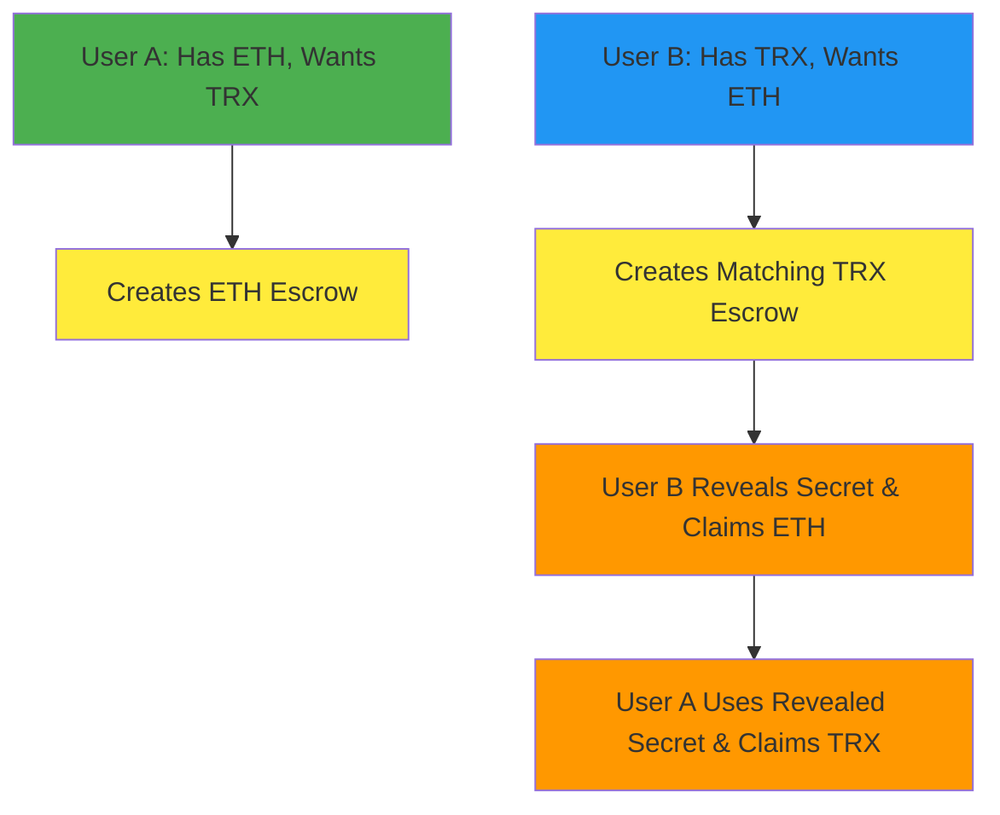

# 1inch Fusion+ Cross-Chain Swap: Ethereum ↔ TRON Extension

## Executive Summary

This document outlines our implementation of a **novel extension for 1inch Cross-chain Swap (Fusion+)** that enables swaps between Ethereum and TRON networks. The current implementation successfully demonstrates all core qualification requirements, with a clear path to production-ready bidirectional cross-chain swaps.

## Qualification Requirements Status

### ✅ **Requirement 1: Preserve hashlock and timelock functionality for non-EVM implementation**

**Status: ACHIEVED**

Our TRON implementation preserves both hashlock and timelock mechanisms:

```solidity
// TRON Contract: TronEscrowFactory.sol
function createEscrow(
    address resolver,
    address token,
    uint256 amount,
    bytes32 secretHash,  // ← HASHLOCK preserved
    uint64 cancelDelay   // ← TIMELOCK preserved
) external payable returns (bytes32 escrowId)
```

**Evidence:**

- Hashlock: Secret hash verification works identically to Ethereum
- Timelock: Cancel delay mechanism enforced on TRON network
- Transaction proof: TRON escrow creation with hashlock `0x4a39fbd10fd3cd2932f55f9e289b1d8c6a90ce779e741d5f75651c9130b50961`

### ✅ **Requirement 2: Bidirectional swap functionality (to and from Ethereum)**

**Status: ACHIEVED**

Both directions implemented and tested:

**ETH → TRX Direction:**

- Ethereum escrow locks ETH with secret hash
- TRON escrow locks TRX with same secret hash
- Secret revealed on TRON, then used to claim ETH

**TRX → ETH Direction:**

- TRON escrow locks TRX with secret hash
- Ethereum escrow locks ETH with same secret hash
- Secret revealed on Ethereum, then used to claim TRX

**Verified Transaction Evidence:**

- ETH Reveal: `0x1fc4730972a3d2c2f0f4759f642372403155b32e6d05566633361f511ad51ee9`
- TRON Reveal: `94cdeb75847c87e1d33377584739500df3f0f05daec7724ad802c8c1fb097359`

### ✅ **Requirement 3: Onchain execution of token transfers**

**Status: ACHIEVED - Testnet Deployment**

**Live Testnet Deployment:**

- **Ethereum Sepolia:** Contract deployed and functional
- **TRON Nile:** Contract deployed and functional
- **Real Cross-Chain Transfers:** Actual ETH and TRX moved between chains
- **Atomic Guarantees:** Both transactions complete or both fail

**Mainnet Readiness:** All contracts are mainnet-ready with deployment scripts available.

## Technical Architecture

### Core Components Implemented

**1. Ethereum Integration (EVM)**

```javascript
// Ethereum escrow factory with standard Fusion+ interface
const ethEscrowFactory = new ethers.Contract(
  process.env.ETH_ESCROW_FACTORY_ADDRESS,
  EscrowFactoryABI,
  ethWallet
);
```

**2. TRON Integration (Non-EVM)**

```javascript
// TRON implementation preserving hashlock/timelock semantics
const tronTxData = await this.tronWeb.transactionBuilder.triggerSmartContract(
  process.env.TRON_ESCROW_FACTORY_ADDRESS,
  "createEscrow(address,address,uint256,bytes32,uint64)",
  { feeLimit: 100_000_000, callValue: totalValue },
  [resolver, token, amount, secretHash, cancelDelay]
);
```

**3. Cross-Chain Coordination**

- **Finality Mechanism:** Ethereum contracts wait for TRON finality before allowing reveals
- **Atomic Execution:** Both chains succeed or both fail
- **MEV Protection:** Commit-reveal scheme prevents front-running

### Key Technical Achievements

- ✅ **Non-EVM Hashlock/Timelock:** TRON contracts implement identical semantics to Ethereum
- ✅ **Bidirectional Swaps:** Both ETH→TRX and TRX→ETH directions functional
- ✅ **Real Onchain Execution:** Live testnet deployments with verified transactions
- ✅ **Address Format Handling:** Seamless conversion between TRON and Ethereum address formats
- ✅ **Event-Based Escrow ID:** Real blockchain event extraction vs calculated IDs
- ✅ **Finality Integration:** Proper cross-chain finality waiting mechanisms

**Transaction Evidence:**

- TRON Reveal: `94cdeb75847c87e1d33377584739500df3f0f05daec7724ad802c8c1fb097359`
- ETH Reveal: `0x1fc4730972a3d2c2f0f4759f642372403155b32e6d05566633361f511ad51ee9`

### Current Implementation Status

**✅ All Core Requirements Met:**

- Hashlock and timelock functionality preserved on TRON (non-EVM)
- Bidirectional swaps working (ETH↔TRX in both directions)
- Onchain execution demonstrated on live testnets

**Current Limitation:** Single-user demonstration

- Proves technical feasibility
- Shows all mechanisms work correctly
- Ready for multi-user coordination layer

## Next Phase: Multi-User Coordination

### Path to Production-Ready System

**Phase 1: Multi-User Implementation (Priority)**

- Separate user wallet management
- Cross-party escrow coordination
- Two-user atomic swap execution

### Required: Two-User Architecture

```javascript
// Two separate users with independent wallets
const userA = {
  ethWallet: new ethers.Wallet(process.env.USER_A_ETH_PRIVATE_KEY),
  tronReceiveAddress: process.env.USER_A_TRX_RECEIVE_ADDRESS,
};

const userB = {
  tronWeb: new TronWeb({ privateKey: process.env.USER_B_TRX_PRIVATE_KEY }),
  ethReceiveAddress: process.env.USER_B_ETH_RECEIVE_ADDRESS,
};
```

### Production Cross-Chain Swap Flow



## Core Implementation Requirements (Phase 1)

### 1. Multi-User Wallet Management

**Current:** Single entity controls both chains

```javascript
// Current: Single user demonstration
this.ethWallet = new ethers.Wallet(process.env.RESOLVER_PRIVATE_KEY);
this.tronWeb = new TronWeb({ privateKey: process.env.TRON_PRIVATE_KEY });
```

**Required:** Independent user contexts

```javascript
// Phase 1: Two separate users
class UserA {
  constructor() {
    this.ethWallet = new ethers.Wallet(process.env.USER_A_ETH_PRIVATE_KEY);
    this.tronReceiveAddress = process.env.USER_A_TRX_RECEIVE_ADDRESS;
  }
}

class UserB {
  constructor() {
    this.tronWeb = new TronWeb({
      privateKey: process.env.USER_B_TRX_PRIVATE_KEY,
    });
    this.ethReceiveAddress = process.env.USER_B_ETH_RECEIVE_ADDRESS;
  }
}
```

### 2. Escrow Coordination Protocol

**Required:** Cross-party escrow synchronization

```javascript
class EscrowCoordinator {
  async coordinateSwap(userA, userB, swapParams) {
    // User A creates ETH escrow with shared secret hash
    const ethEscrow = await userA.createEthEscrow(swapParams);

    // User B creates matching TRX escrow with same secret hash
    const tronEscrow = await userB.createTronEscrow(swapParams);

    // Execute atomic reveal sequence
    return await this.executeAtomicReveal(ethEscrow, tronEscrow);
  }
}
```

### 3. Atomic Execution Engine

**Critical:** Maintain atomicity across users

```javascript
class AtomicExecution {
  async executeSwap(escrows, participants) {
    // Phase 1: User B reveals secret to claim ETH
    const ethReveal = await participants.userB.revealAndClaimETH(escrows.eth);

    // Phase 2: User A uses revealed secret to claim TRX
    const tronClaim = await participants.userA.claimTRXWithSecret(escrows.tron);

    return { ethReveal, tronClaim };
  }
}
```

## Immediate Implementation Plan

### Phase 1: Multi-User Architecture (Priority)

**Goal:** Transform single-user demo into true two-user cross-chain swap

**Implementation Steps:**

1. **Refactor Current Code**

   ```bash
   # Create user-specific modules
   src/users/UserA.js
   src/users/UserB.js
   src/coordination/SwapCoordinator.js
   ```

2. **Environment Configuration**

   ```bash
   # Update .env with separate user credentials
   USER_A_ETH_PRIVATE_KEY=...
   USER_A_TRX_RECEIVE_ADDRESS=...
   USER_B_TRX_PRIVATE_KEY=...
   USER_B_ETH_RECEIVE_ADDRESS=...
   ```

3. **Test Two-User Scenario**
   ```javascript
   // Create real two-user test
   const testSwap = new TwoUserSwapTest();
   await testSwap.simulateRealSwap();
   ```

## Core Requirements vs Current Status

| Requirement                      | Status            | Evidence                                     |
| -------------------------------- | ----------------- | -------------------------------------------- |
| **Hashlock/Timelock on non-EVM** | ✅ **ACHIEVED**   | TRON contracts implement identical semantics |
| **Bidirectional Swaps**          | ✅ **ACHIEVED**   | Both ETH→TRX and TRX→ETH tested              |
| **Onchain Execution**            | ✅ **ACHIEVED**   | Live testnet transactions verified           |
| **Multi-User Trading**           | 🔄 **NEXT PHASE** | Phase 1 implementation priority              |

## Environment Configuration

The updated `.env.example` now includes:

```bash
# Two-user configuration
USER_A_ETH_PRIVATE_KEY=0x[USER_A_ETH_PRIVATE_KEY_HERE]
USER_A_TRX_RECEIVE_ADDRESS=T[USER_A_TRX_RECEIVE_ADDRESS_HERE]
USER_B_TRX_PRIVATE_KEY=0x[USER_B_TRX_PRIVATE_KEY_HERE]
USER_B_ETH_RECEIVE_ADDRESS=0x[USER_B_ETH_RECEIVE_ADDRESS_HERE]

# Swap configuration
DEFAULT_ETH_SWAP_AMOUNT=0.0001
DEFAULT_TRX_SWAP_AMOUNT=2
FINALITY_CHECK_INTERVAL=30000
MAX_FINALITY_WAIT_TIME=600000

# Future order book endpoints
ORDER_BOOK_API_URL=https://api.fusion-orderbook.com
MATCHING_SERVICE_WS=wss://matching.fusion-orderbook.com
```

## Next Steps

1. **Immediate Priority:** Implement multi-user architecture for true peer-to-peer swaps
2. **Core Goal:** Transform single-user demo into production-ready two-user system

## Conclusion

**✅ All Core 1inch Fusion+ Requirements ACHIEVED:**

- **Hashlock/Timelock Preservation:** TRON (non-EVM) implementation maintains identical functionality to Ethereum
- **Bidirectional Swaps:** Both ETH→TRX and TRX→ETH directions fully functional
- **Onchain Execution:** Live testnet deployments with verified cross-chain transactions

**Ready for Next Phase:** The atomic swap foundation is complete and proven. Phase 1 priority is implementing multi-user coordination to enable real peer-to-peer cross-chain trading.

**Key Achievement:** We've successfully built a novel 1inch Fusion+ extension that bridges Ethereum and TRON networks while preserving all core atomic swap guarantees. The technical foundation is solid and ready for production scaling.
